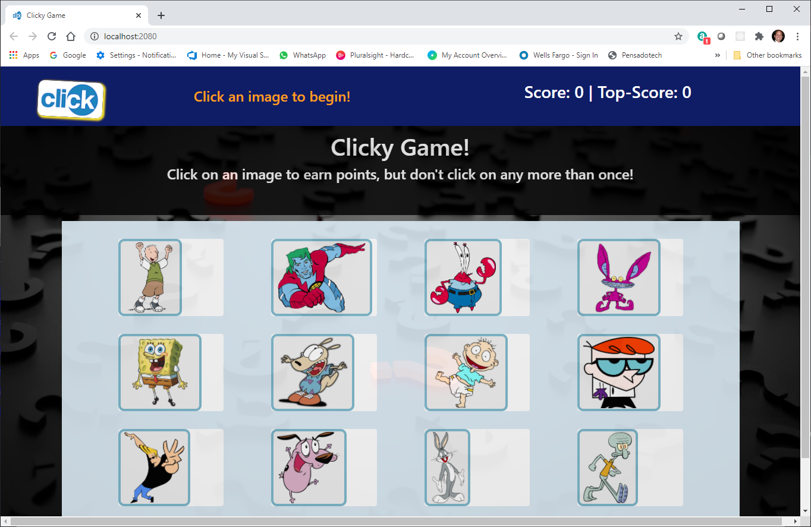
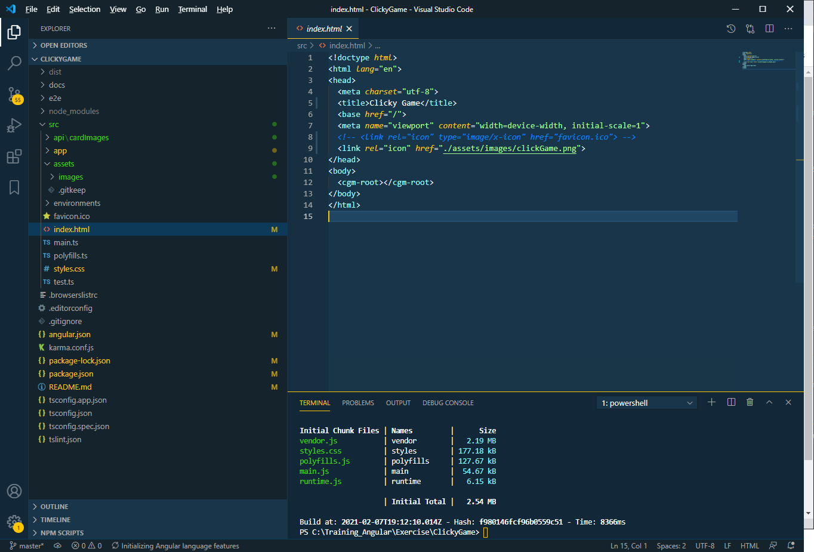

# ClickyGame NG

_By Armando Pensado_

## Description

The application is a memory game using Angular. The application falls into the definition of a single page application, and was built using several components. 

The general idea about the game, is that the application present twelve cards and the user need to start selecting them, remembering what was selected before.  To win the game the user must select all card only one time. Selecting a card twice, the game is lost.

This project was generated with [Angular CLI](https://github.com/angular/angular-cli) version 11.1.2.

## How does it work

The application will present the cards once is loaded. Every time the user selects a card, the application will shuffle them, changing positions. As the user selects more cards, it will be harder to remember what card has been selected already.

For each card selected once, the application will increase the score by one point and it will keep track of the top-score, if the user plays the game more than once.

The user just needs to click a card to get the game started. There will be messages at the top as the game progresses. If all twelve cards as selected once, the user will se a “YOU WIN!” message on the top.

## Who can benefit from this application

Angular developer can benefit with this example applicaiton. It presents a ame structure broken into multiple components. Anyone learning Angular program can find it an interesting little challenge. 

## How developers can get started

To start, the developer must have Angular CLI and NPM installed in the computer. Normally, it is recomended to have NodeJs that comes with teh lates NPM version. Te project can be cloned or downloaded, and initialized.  Here are the steps for getting started.

1. For installing NodeJS refer to the following link https://nodejs.org/en/

2. For installing Angular CLI, refer to the link: https://angular.io. However the command is as follows:

        npm install -g @angular/cli 

3. Clone ordownload the project into the computer. After, the initialization, and using Microsoft Visual Code, the project folder should resemble as depicted below, and should be ready for execution.

4. Start the project with teh command

         npm start or ng serve -output

At this point the game should be runing un der development mode.  The reader can use teh build command to create the deployment package for a web server.

## Who maintains and contributes to the project

This is a personal project fro my own learing experience. 

## Where users can get help with the project

The developer can refer to the following links:

* NodeJs  : https://nodejs.org/en/
* Angular : https://angular.io/

## Additiona infromation 

### Development server

Run `ng serve` for a dev server. Navigate to `http://localhost:4200/`. The app will automatically reload if you change any of the source files.

### Code scaffolding

Run `ng generate component component-name` to generate a new component. You can also use `ng generate directive|pipe|service|class|guard|interface|enum|module`.

### Build

Run `ng build` to build the project. 
The build artifacts will be stored in the `dist/` directory. 
Use the `--prod` flag for a production build.

For Tomcat servers, define the --base-href parameter for the folder that will contain the application. The command is as follows:

   ng build --base-href <myFolder> --prod

For example, if the application will be under webapps/static/ClientNg1, the command will be as follows:
  
     ng build --base-href /static/ClientNg1/ --prod

In this case the base-href is /static/ClientNg1/

### Running unit tests

Run `ng test` to execute the unit tests via [Karma](https://karma-runner.github.io).

### Running end-to-end tests

Run `ng e2e` to execute the end-to-end tests via [Protractor](http://www.protractortest.org/).

### Further help

To get more help on the Angular CLI use `ng help` or go check out the [Angular CLI Overview and Command Reference](https://angular.io/cli) page.
